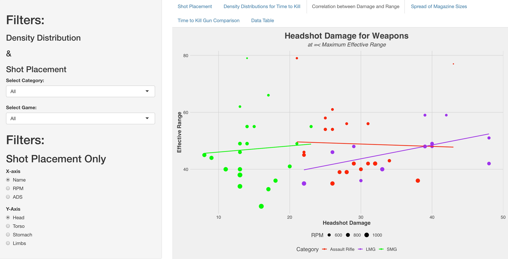
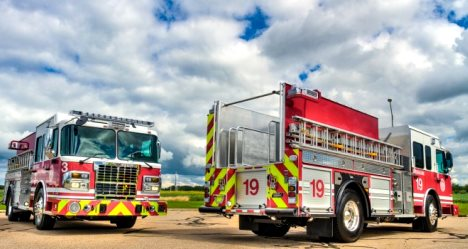

# My Projects by Tristan Appleby

## [DATA ANALYSIS PROJECT - GROCERY CHAIN SALES MANAGEMENT](https://programtristan.github.io/GroceryStore_Sales_Analysis/)

### Project overview
* This project explores sales data for an international grocery store chain.
* I explore the relation between sales, regions, customers, products, stores, returns and date.
* We can obtain conclusions that will help us to make better marketing campaigns and improve profits.
* The tools used are Excel and Power BI

You can access to it **[HERE](https://programtristan.github.io/GroceryStore_Sales_Analysis/)**

## [WARZONE DATABASE & ANALYSIS](https://programtristan.github.io/Warzone_Database/)

### Project overview
* This project explores weapon damage data for 2 video games
* I create a SQL database that will hold all entires
* Following, I connect an R shiny app to the database.

You can access to it **[HERE](https://programtristan.github.io/Warzone_Database/)**

## [MACHINE LEARNING - SAN FRANSISCO FIRE DEPARTMENT ](https://programtristan.github.io/FireDepartment_MachineLearning/)

### Project overview
- Observing thousands of observations from the years 2000-2016
- Predict future False Alarms
- Report which features can me monitored to reduce Fasle Alarms
- The libraries used were pyspark and numpy

You can access to it **[HERE](https://programtristan.github.io/FireDepartment_MachineLearning/)**

