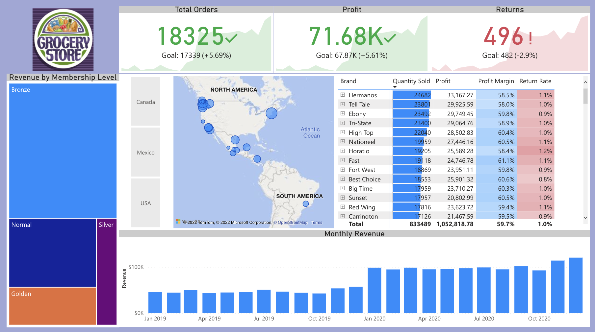
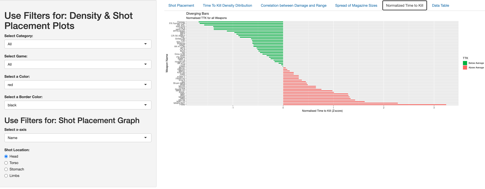

# My Projects by Tristan Appleby

## [DATA ANALYSIS PROJECT - GROCERY CHAIN SALES MANAGEMENT](https://programtristan.github.io/GroceryStore_Sales_Analysis/)

### Project overview
* This project explores sales data for an international grocery store chain.
* I explore the relation between sales, regions, customers, products, stores, returns and date.
* We can obtain conclusions that will help us to make better marketing campaigns and improve profits.
* The tools used are Excel and SQL 

You can access to it **[HERE](https://programtristan.github.io/GroceryStore_Sales_Analysis/)**

## [WARZONE DATABASE & ANALYSIS](https://programtristan.github.io/Warzone_Database/)

### Project overview
* This project explores weapon damage data for 2 video games
* I create a SQL database that will hold all entires
* Following, I connect an R shiny app to the database.

You can access to it **[HERE](https://programtristan.github.io/Warzone_Database/)**

## [PYTHON - BANK LOANS ANALYSIS](https://roberto121c.github.io/Bank_loans_analysis/)

### Project overview
- We need to know which factors influence to give a loan
- We also need to look for any opportunity to increase the bank's assets.
- It was found that apart from income, family size is an important factor to give loans.
- The libraries used were pandas, numpy, matplotlib, seaborn and scipy.

You can access to it **[HERE](https://roberto121c.github.io/Bank_loans_analysis/)**

